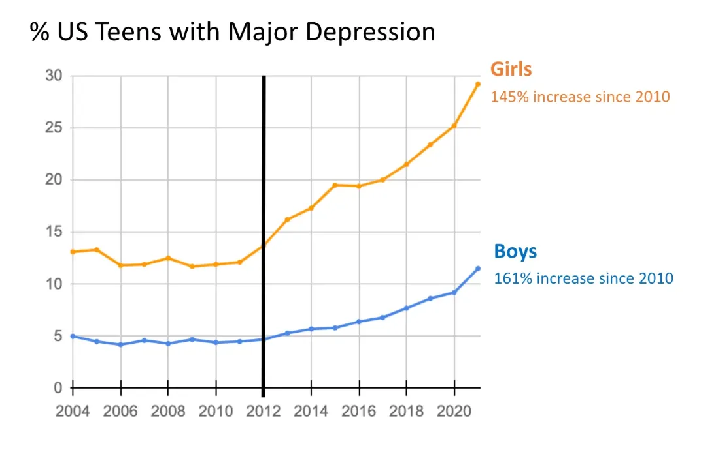

# Mental health transformer counselor

This project is coursework for Advanced Machine Learning Methods (*pl. Zaawansowane metody uczenia maszybowego*) and focuses on training a LLM model for seq-to-seq task. Our objective is to implement and train model basing on *state-of-the-art* transformer architecture presented in 2017 and apply it to mental disorders problem to imitate mental health counselor.

# Introduction

In recent years, mental health issues have become increasingly prevalent across the globe. This rise is not limited to any single demographic; rather, it affects individuals of all ages, professions, and social statuses. The World Health Organization (WHO) estimates that approximately one in four people will experience a mental health condition at some point in their lives. This statistic underscores the universality of mental health challenges and the pressing need for societal recognition and comprehensive approaches to address them.

 

With the rapid advancement of artificial intelligence, AI models have emerged as powerful tools with the potential to revolutionize many fields, including mental health care. Large Language Models can be helpful for mental health care by acting as AI counselors, providing accessible and immediate support to a wide range of users. They can offer personalized interactions, educate on mental health topics, and identify early signs of distress. While not a replacement for human therapists, LLMs can supplement traditional therapy by providing continuous support and resources. Ethical use and integration into existing care systems are crucial to ensure their effectiveness and safety in addressing the mental health crisis.

As we navigate the complexities of the global mental health crisis, the integration of AI into mental health care offers a promising avenue to expand access and enhance support. By leveraging the capabilities of AI, we can create more inclusive and responsive mental health systems that address the diverse needs of individuals. Ethical and thoughtful implementation of AI tools can help us move closer to a future where mental health care is accessible, personalized, and continuously available for all.
# Goals of the project

The primary aim of this project is to explore the potential of LLMs to recognize and respond to nuanced patterns related to mental health, effectively emulating the role of a therapist or counselor. The project relies on state-of-the-art implementation of transformer in *Attention is all you need* (2017) paper. More specific goals of the project are:

- [ ] gather and prepare dataset for mental health counseling,

- [ ] implement from scratch transformer model architecture according to *Attention is all you need* paper,

- [ ] train model so it will give reasonable and well structured response sentences according to the given input

# Project structure

Files in this project are stored in few seperate directories:

- `./datasets/` - contains two files of dataset used for training and evaluation of built model,
- `./notebooks/` - here you'll find you'll find Jupyter notebooks that serve as the practical component of the project:
	- `EDA.ipynb` - exploratory data analysis of dataset used for training and evaluation,
	- `model-training.ipynb` - implementation of transformer with training procedure,
	- `model-eval.ipynb` - final model evaluation with human review and set of evaluation metrics.
- `./htmls/` - notebooks described above in nicer *read-only* form.

# References

Apart from the bibliography, this project heavily relied on two key sources without which it might never have been completed:

- [Podręcznik do przedmiotu Zaawansowane metody uczenia maszynowego](https://majerek.quarto.pub/zaawansowane-metody-uczenia-maszynowego) - coursebook to the subject Advanced Machine Learning Methods (*pl. Zaawansowane metody uczenia maszynowego*). Visit author's other contents [here](https://github.com/dax44).
- [Coding a Transformer from scratch on PyTorch, with full explanation, training and inference](https://github.com/hkproj/pytorch-transformer) - start-to-end transformer from scratch implementation by [Umar Jamil](https://github.com/hkproj)

## Bibliography
[1] Haidt, J., Rausch, Z., & Twenge, J. (ongoing). _Adolescent mood disorders since 2010: A collaborative review_. Unpublished manuscript, New York University.
    
[2] Hua, Y., Liu, F., Yang, K., Li, Z., Sheu, Y.-h., Zhou, P., Moran, L. V., Ananiadou, S., & Beam, A. (2024). _Large Language Models in Mental Health Care: a Scoping Review_. arXiv preprint arXiv:2401.02984.
    
[3] Khurana, D., Koli, A., Khatter, K. et al. (2023). Natural language processing: state of the art, current trends and challenges. _Multimed Tools Appl_ **82**, 3713–3744. [https://doi.org/10.1007/s11042-022-13428-4](https://doi.org/10.1007/s11042-022-13428-4).

[4] Majerek, D., *Zaawansowane metody uczenia maszynowego*, https://majerek.quarto.pub/zaawansowane-metody-uczenia-maszynowego/, Accessed 21.06.2024. 

[5] Vaswani, A., et al. _Attention is all you need_. Neural Information Processing Systems, 2017.
    
[6] World Health Organization. (2001). _The World health report : 2001 : Mental health : new understanding, new hope_. World Health Organization. [https://iris.who.int/handle/10665/42390](https://iris.who.int/handle/10665/42390).

[7] Amod, *mental_health_counseling_conversations*, Retrieved from https://huggingface.co/datasets/Amod/mental_health_counseling_conversations, Accesed 12.06.2024.

[8] Alexandreteles, *mental-health-conversational-data*, Retrieved from https://huggingface.co/datasets/alexandreteles/mental-health-conversational-data, Accesed 15.06.2024.

[9] Allenai, *prosocial-dialog*, Retrieved from https://huggingface.co/datasets/allenai/prosocial-dialog, Accesed 15.06.2024.

[10] Heliosbrahma, *mental_healt_conversational_dataset*, Retrieved from https://huggingface.co/datasets/heliosbrahma/mental_health_conversational_dataset, Accesed 15.06.2024.

[11] Samhog, *psychology-10k*, Retrieved from https://huggingface.co/datasets/samhog/psychology-10k, Accesed 15.06.2024.

[12] Jkhedri, *psychology-dataset*, Retrieved from https://huggingface.co/datasets/jkhedri/psychology-dataset, Accesed 15.06.2024.

[13] Marmikpandya, *mental-health*, Retrieved from https://huggingface.co/datasets/marmikpandya/mental-health, Accesed 15.06.2024.

[14] KelvinTichana2, *mentalhealthcurated*, Retrieved from https://huggingface.co/datasets/KelvinTichana2/mentalhealthcurated, Accesed 15.06.2024.

[15] Khurana, D., Koli, A., Khatter, K. _et al._ Natural language processing: state of the art, current trends and challenges. _Multimed Tools Appl_ **82**, 3713–3744 (2023). https://doi.org/10.1007/s11042-022-13428-4

